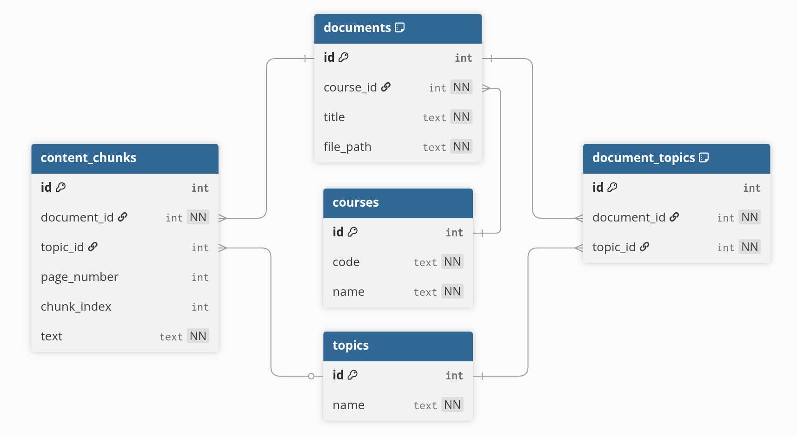

# AI Chatbot Course Material Database  
### A PostgreSQL Knowledge Base for Lecture PDF Processing

This repository contains the full PostgreSQL database, schema, ingestion scripts, and documentation for an AI-powered chatbot designed to answer students’ questions using course lecture materials extracted from PDF slides.

The system automatically reads PDF files, extracts text, identifies topics, splits the text into searchable chunks, and stores everything in a normalized relational database.  
It enables fast, accurate retrieval of relevant content for downstream chatbot or NLP applications.

---

## Project Overview

This project was developed for the **Database Systems** course.  
Our goal was to create a structured and scalable data storage solution that supports:

- Automatic import of many lecture PDFs  
- Topic extraction from slide titles  
- Text chunking for LLM-based question answering  
- Efficient SQL search across documents, topics, and content  
- Easy collaboration between teammates  
- A clean and normalized relational model  

All processing is handled by a single Python ingestion script that fills **all tables automatically**, with zero manual data entry.

And use this data to retrieve it through the **chatbot**.

---

## Database Schema

The knowledge base contains **five relational tables**, designed for clarity, normalization, and scalability.

### **1. courses**
Stores information about a course (e.g., CS360).
| Column | Description |
|--------|-------------|
| `id` | Primary key |
| `code` | Course code (unique) |
| `name` | Course name |

---

### **2. documents**
Represents each lecture PDF.
| Column | Description |
|--------|-------------|
| `id` | Primary key |
| `course_id` | FK to courses |
| `title` | File name without extension |
| `file_path` | Absolute/relative path to PDF |

---

### **3. topics**
Unique topics extracted from slide titles.
| Column | Description |
|--------|-------------|
| `id` | Primary key |
| `name` | Topic name (unique) |

---

### **4. document_topics**
Many-to-many link between documents and topics.
| Column | Description |
|--------|-------------|
| `id` | Primary key |
| `document_id` | FK to documents |
| `topic_id` | FK to topics |

---

### **5. content_chunks**
Stores the actual text used by the AI chatbot.
| Column | Description |
|--------|-------------|
| `id` | Primary key |
| `document_id` | FK to documents |
| `topic_id` | FK to topics |
| `page_number` | Slide/page number in PDF |
| `chunk_index` | Order of chunk on the page |
| `text` | Extracted text chunk |

Text is automatically split into chunks (~800 chars max) to ensure efficient semantic search and LLM performance.



---

## What SQL queries does the chatbot use?

### Example: retrieve useful chunks
```sql
SELECT text
FROM content_chunks
WHERE topic_id = (SELECT id FROM topics WHERE name = 'Design patterns')
ORDER BY page_number, chunk_index
LIMIT 10;
```

### Example: search by keyword
```sql
SELECT text
FROM content_chunks
WHERE text ILIKE '%REST%' OR text ILIKE '%HTTP%';
```

### Example: find topics in a document
```sql
SELECT t.name
FROM topics t
JOIN document_topics dt ON dt.topic_id = t.id
WHERE dt.document_id = 3;
```
---

## Automated PDF Ingestion Pipeline

All PDFs are processed automatically by the script `ingest_pdfs.py`.  
The pipeline performs:

1. **PDF reading** (page-by-page using pdfplumber)  
2. **Topic extraction** (first non-empty line of each slide)  
3. **Chunking** (split text into manageable short segments)  
4. **Inserting/updating course & documents**  
5. **Inserting topics** (with deduplication)  
6. **Linking topics to documents**  
7. **Inserting all text chunks**  
8. **Ensuring the script is safely re-runnable** (old chunks are replaced)

This approach ensures a fully automated and deterministic database.

---

## How to Import the Database

### **Using Terminal**

```bash
createdb chatbot_cheatsheet_db
psql -d chatbot_cheatsheet_db -f chatbot_cheatsheet_db.sql
```

## How to Run the PDF Ingestion Script

### Requirements

1. Python 3
2. PostgreSQL
3. psycopg2-binary
4. pdfplumber

```bash
pip install psycopg2-binary pdfplumber
python3 scripts/ingest_pdfs.py
```

## How to Run the RAG chatbot

Open the .ipynb file on Google Colab and choose GPU as the runtime processor. Make sure to upload the given .sql file.
